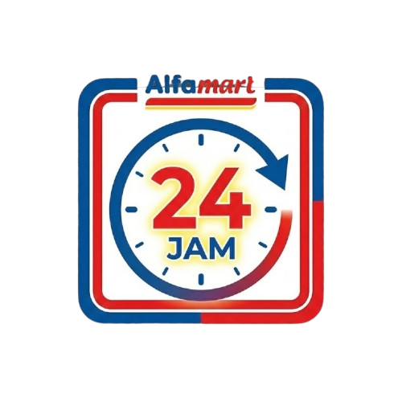

<p align="center">
  
</p>

<h1 align="center">Laporan Shift 3</h1>

<p align="center">
  
</p>

<p align="center">
  
  
  
  
  
</p>

## Ringkasan
Laporan Shift 3 membantu input data harian SPD, STD, APC, dan pulsa agar cepat dibuat, konsisten, dan aman dari kehilangan data. Web ini memakai Firebase Auth dan Firestore, dengan cache lokal untuk pengalaman cepat dan tahan refresh.

## Fitur Utama
- Input harian SPD/STD/Pulsa, APC dihitung otomatis.
- Ringkasan bulanan: total SPD, STD, pulsa, rata-rata APC.
- Auto-save lokal + sinkron Firestore (data aman saat refresh/keluar tab).
- Import salinan laporan (bulk), copy laporan, export Excel.
- Login email/password dan Google.

## Struktur Proyek
- `src/`: Web React + Vite.
- `mobile/`: Aplikasi React Native / Expo.
- `public/`: Asset statis untuk web.

## Menjalankan Web
```bash
npm install
npm run dev
```
Buka `http://localhost:5173`.

## Menjalankan Mobile (React Native/Expo)
```bash
cd mobile
npm install
npm run android
```
Atau gunakan `npm start` dan scan QR di Expo Go.

## Konfigurasi Firebase
Buat file `.env` di root dengan isi berikut:
```
VITE_FIREBASE_API_KEY=...
VITE_FIREBASE_AUTH_DOMAIN=...
VITE_FIREBASE_PROJECT_ID=...
VITE_FIREBASE_STORAGE_BUCKET=...
VITE_FIREBASE_MESSAGING_SENDER_ID=...
VITE_FIREBASE_APP_ID=...
VITE_FIREBASE_MEASUREMENT_ID=...
```

## Persistensi Data
- Setiap perubahan disimpan ke localStorage dan Firestore secara otomatis.
- Saat load, aplikasi memilih data dengan `updatedAt` terbaru agar cache lokal tidak tertimpa data lama.
- Jika data cloud belum ada, cache lokal akan diunggah saat koneksi tersedia.

## Catatan
- Gunakan tombol Reset untuk menghapus laporan pada meta aktif.
- Export Excel tersimpan lokal di perangkat (browser download).
